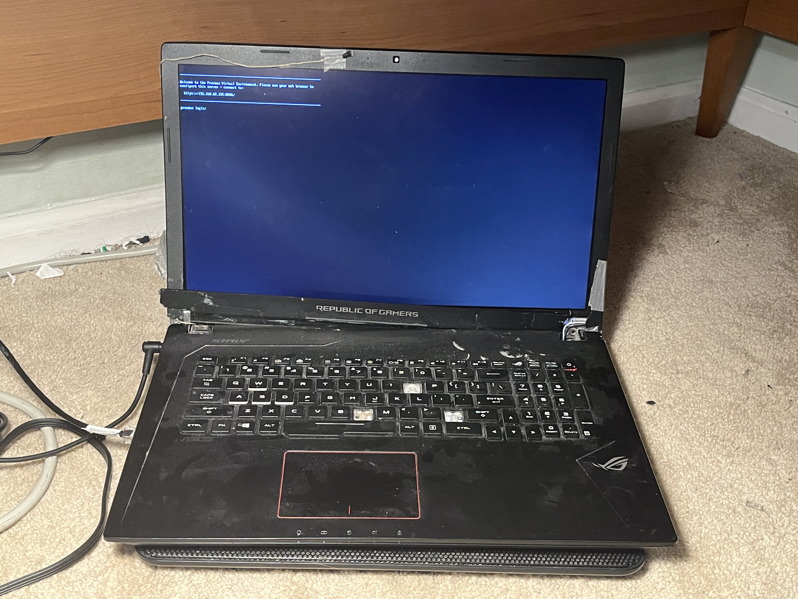
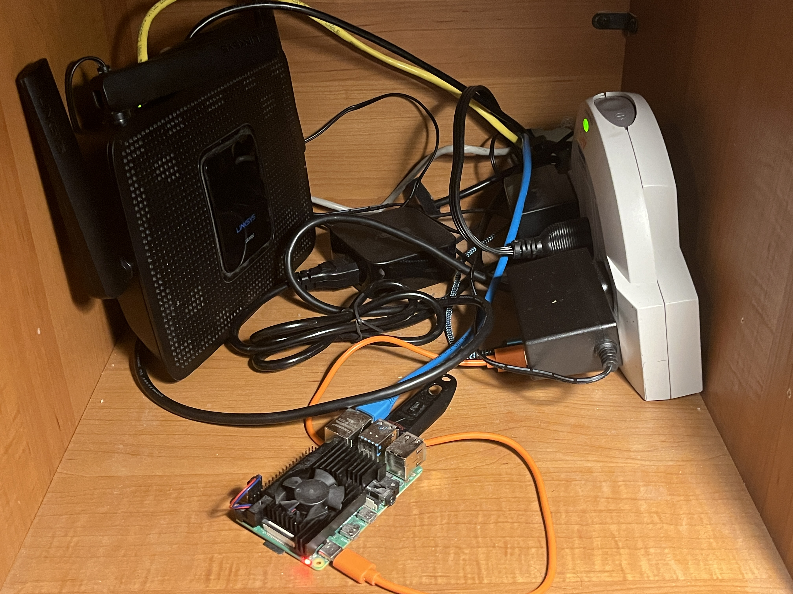

+++
date = '2025-11-10T20:39:00-05:00'
draft = true
title = 'Hardware Overview'
authors = ["Andrew Warner"]
tags = ["homelab", "hardware"]
coverCaption = "My homelab, hidden under my desk"
+++

<!-- TODO add photos -->

My homelab currently consists of three computing devices combined with an unconventional networking setup. I have a NAS, a Proxmox server, and a Raspberry Pi. This has been built for nearly free over a couple of years.

## NAS

My NAS is an old Dell OptiPlex with a Pentium G630 and 4GB of ram. I got this for free from a relative's workplace. As far as I can tell, it was used to run a photo booth, because when I got it, it had Windows 7 installed on the 265gb HDD with a photo booth user and some errors from missing hardware.

I have since installed OpenMediaVault on an SSD and connected two 1TB laptop hard drives in a ZFS pool. I am only using about 250GB at the moment, but I want to upgrade this to at least four or eight terabytes of total storage soon. Unfortunately the OptiPlex only has 3 SATA ports, so using more than two data drives will require either adding an HBA, or replacing the OptiPlex entirely.

The NAS has shared folders for my movie and photo collections, which are shared with my docker virtual machine for Jellyfin and Immich. It also holds ISO images and backups for Proxmox.

## Proxmox Server

I have Proxmox running on my battered old gaming laptop. I got it for free from a local buy nothing group, and used it as a desktop replacement for about four years before I built my current pc. The hinges were broken when I got it, and it has slowly lost keys on the keyboard over time. The forward slash (`/`) key likes to randomly register key presses, so I keep the keyboard disabled.

The internal hardware is actually somewhat decent. The laptop has an i7-7700hq and a GTX 1050ti with 4gb of VRAM. Connected to that are 16gb of ram, a 128gb SATA m.2 SSD, and a 1TB SATA HDD.

This system replaced the Raspberry Pi, which has been repurposed as a dedicated Pi-hole device.

## Raspberry Pi

I have a Raspberry Pi 4b with 4gb of ram. For about a year, this was the entirety of my homelab, with multiple laptop hard drives connected through a USB hub. A couple of months ago I moved the NAS to the OptiPlex because I got a drive failure and wanted to set up some sort of redundancy. I just recently set up the Proxmox server to house my docker containers because I was running out of space on the 32GB microSD card, and because I wanted to have a separate virtual machine for public accessible services.

## Networking

My network stack consists of an old router running OpenWRT, connected to a TP-Link Deco mesh wifi system. Unfortunately, my homelab does not fit where the internet connection comes in, so It is connected wirelessly via one of the Deco access point.
